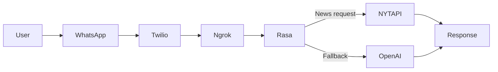
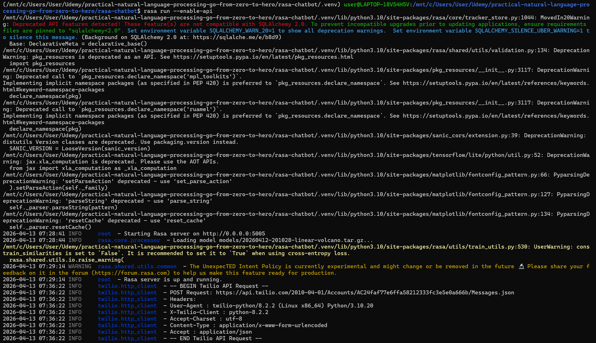
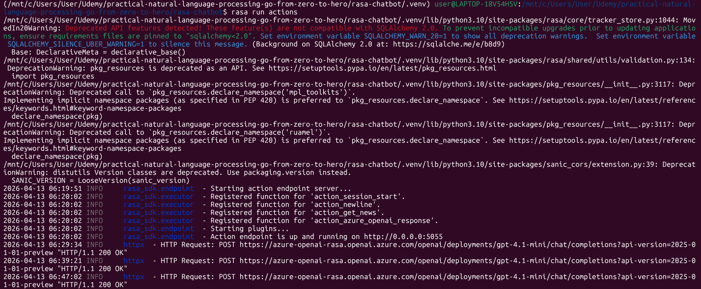
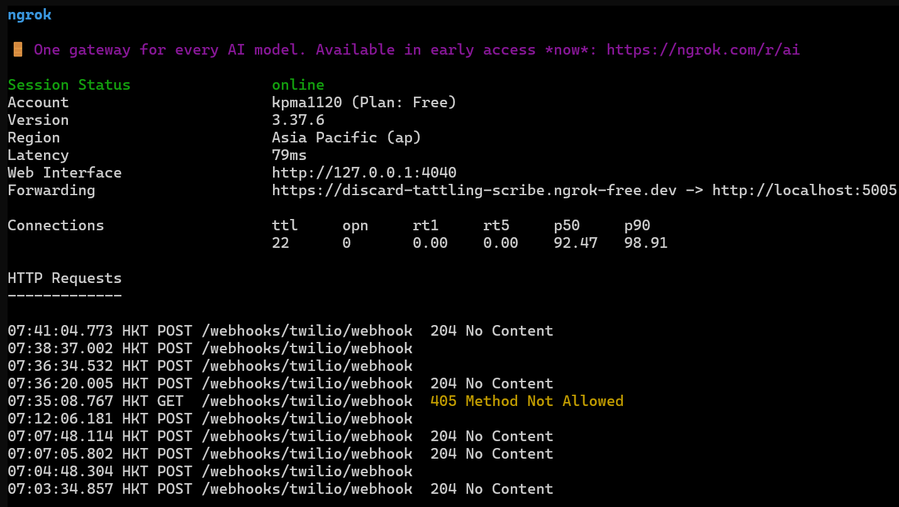
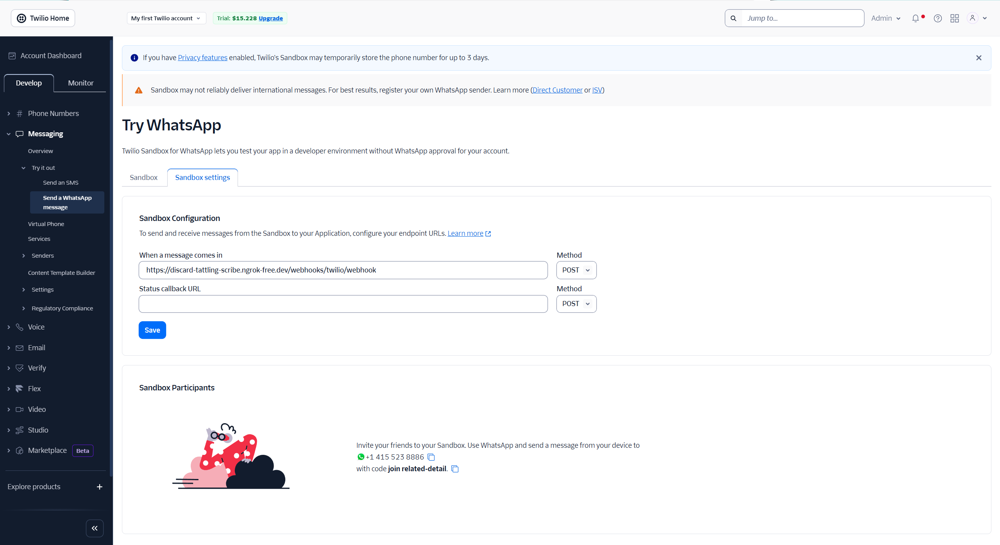
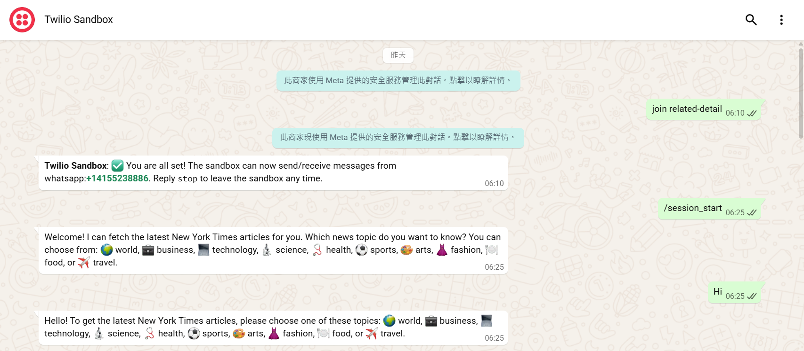
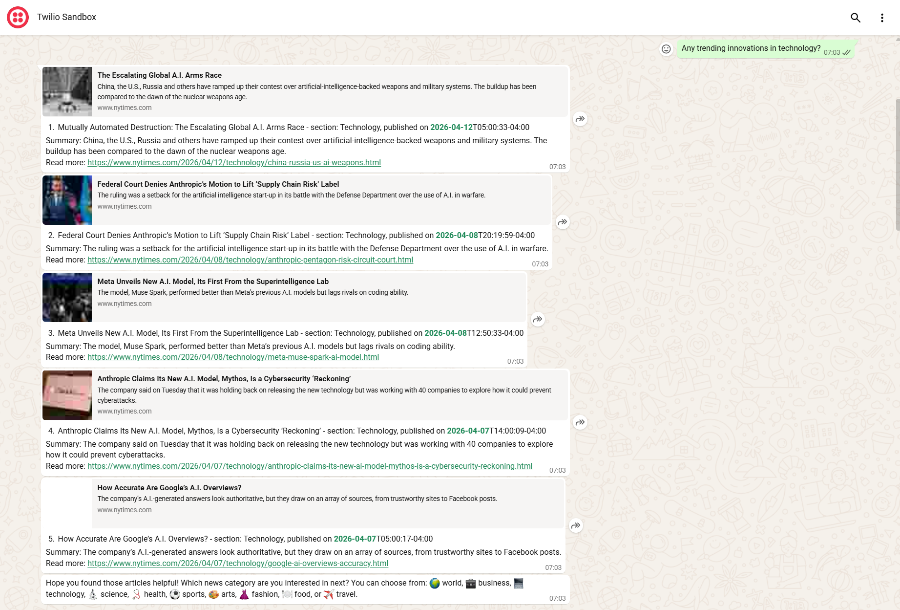
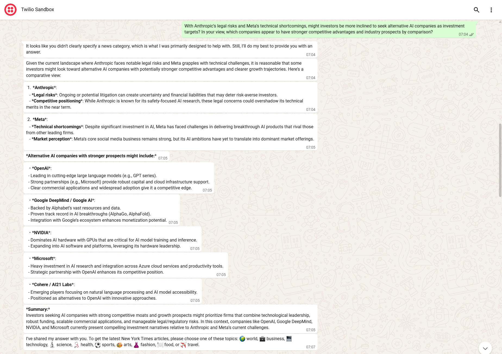
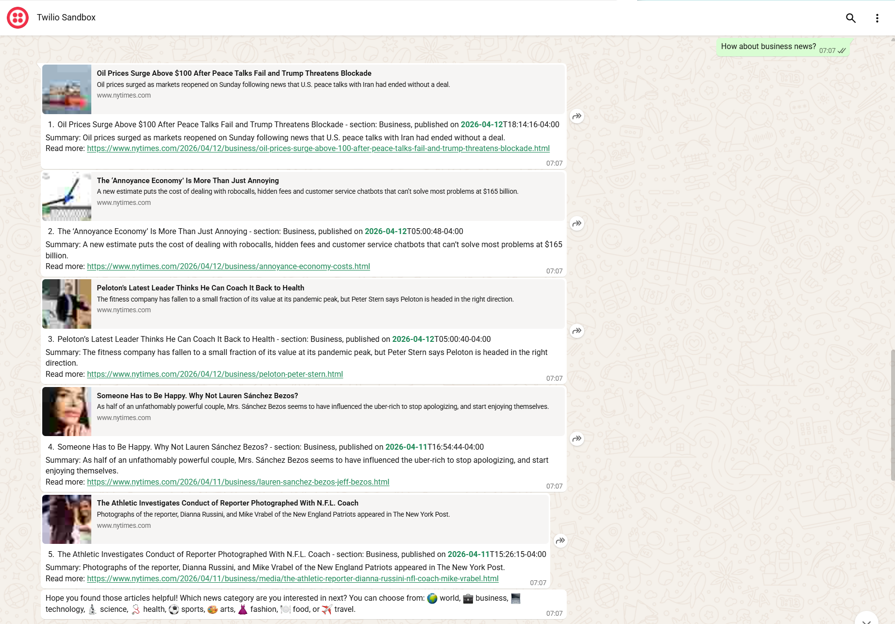
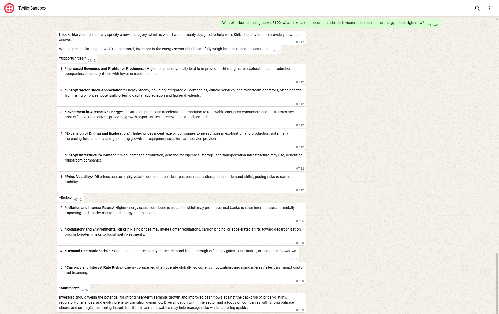

## Rasa & Azure OpenAI Chatbot Showcase — New York Times News Bot

## 📌 Project Overview
This project showcases a chatbot designed primarily as a **New York Times news summarization tool**.  
At its core, the bot leverages **Rasa** to manage dialogue flows and deliver concise news summaries retrieved from the **New York Times API**, serving users with timely business and world updates.  

To enhance robustness, the system integrates **Azure OpenAI (GPT‑4.1‑mini)** as a **fallback response generator**. When users pose unexpected or off‑topic questions beyond the scope of news summarization, Azure OpenAI provides natural language answers to maintain a smooth conversational experience.  

The chatbot is deployed through the **Twilio WhatsApp Sandbox**, with **Ngrok** providing a secure public endpoint for local development and testing. This setup ensures accessibility while keeping the architecture lightweight and developer‑friendly.  

---

## 🛠️ Tech Stack
- **Rasa** (dialogue management)
- **Azure OpenAI GPT‑4.1‑mini** (chat model)
- **Spacy** (NLP pipeline)
- **Twilio WhatsApp Sandbox** (chat interface)
- **Ngrok** (tunneling for local deployment)
- **New York Times API** (news source)

---

## 🏗️ Architecture
Message flow:  
**User → WhatsApp → Twilio Sandbox → Ngrok webhook → Rasa chatbot → New York Times API | Azure OpenAI → Response**



---

## ⚙️ Setup Instructions
1. Clone the repository  
2. Create a virtual environment with Python 3.10.*
3. Install dependencies (`requirements.txt`)  
4. Configure environment variables in `.env.example` (NYTIMES_API_KEY, Azure OpenAI API Key, etc.), renamed as `.env`
5. Configure Twilio credentials in `credentials.yml.example`, renamed as `credentials.yml`  
6. Start Rasa server:  
   ```bash
   rasa run --enable-api
   ```  
7. Start action server:  
   ```bash
   rasa run actions
   ```  

<div align="center">
  
  <p><em>Rasa server startup success</em></p>
</div>

<div align="center">
  
  <p><em>Rasa action server startup success</em></p>
</div>

---

## 🔌 Deployment
- Steps:  
  1. Install Ngrok
  2. Start Ngrok:  
     ```bash
     ngrok http 5005
     ```  
  3. Copy the Ngrok URL and configure it in Twilio Sandbox webhook settings:
     ```
     https://discard-tattling-scribe.ngrok-free.dev/webhooks/twilio/webhook
     ```

<div align="center">
  
  <p><em>Ngrok startup success</em></p>
</div>

<div align="center">
  
  <p><em>Configuration for Twilio Whatsapp sandbox webhook</em></p>
</div>

---

## 🚀 Usage
- Example interaction:  
  - Bot: Welcome message: `Welcome! I can fetch the latest New York Times articles for you. Which news topic do you want to know? You can choose from: 🌍 world, 💼 business, 💻 technology, 🔬 science, 🩺 health, ⚽ sports, 🎨 arts, 👗 fashion, 🍽 food, or ✈️ travel.`
  - User: `Hi`
  - Bot: Greeting message: `Hello! To get the latest New York Times articles, please choose one of these topics: 🌍 world, 💼 business, 💻 technology, 🔬 science, 🩺 health, ⚽ sports, 🎨 arts, 👗 fashion, 🍽 food, or ✈️ travel.`
  - User: `Any trending innovations in technology?`
  - Bot: Returns summarized articles from New York Times Technology section
  - User: `With Anthropic’s legal risks and Meta’s technical shortcomings, might investors be more inclined to seek alternative AI companies as investment targets? In your view, which companies appear to have stronger competitive advantages and industry prospects by comparison?`
  - Bot: Generates answer by calling Azure OpenAI GPT‑4.1‑mini
  - User: `How about business news?`
  - Bot: Returns summarized articles from New York Times Business section
  - User: `With oil prices surging past $100 and companies like Peloton struggling to regain stability, how should investors balance short-term market shocks with long-term business fundamentals?`
  - Bot: Generates answer by calling Azure OpenAI GPT‑4.1‑mini
  - User: `Goodbye`
  - Bot: Goodbye message: `Goodbye! Have a great day.`

<div align="center">
  
  <p><em>Whatsapp interaction stage 1  — Start & Greeting </em></p>
</div>

<div align="center">
  
  <p><em>Whatsapp interaction stage 2  — Technology news</em></p>
</div>

<div align="center">
  
  <p><em>Whatsapp interaction stage 3  — Technology open-ended question</em></p>
</div>

<div align="center">
  
  <p><em>Whatsapp interaction stage 4  — Business news</em></p>
</div>

<div align="center">
  
  <p><em>Whatsapp interaction stage 5  — Business open-ended question</em></p>
</div>

<div align="center">
  
  <p><em>Whatsapp interaction stage 6  — Goodbye & Stop</em></p>
</div>

---

## 🔮 Future Work
- Enhance chat memeory management  
- Deploy to cloud (Render / Railway / Azure Web App)  
- Add multilingual support  
- Support additional messaging platforms (Slack, Telegram)  
